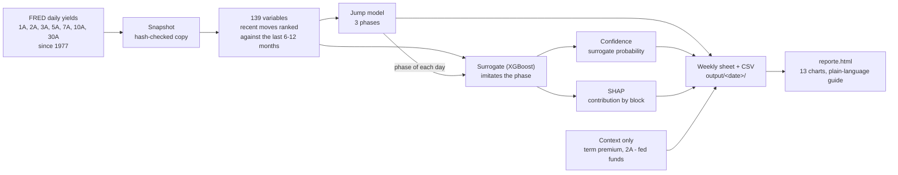

# TERMO — Treasury Environment & Regime MOnitor

Weekly context tool for an investment committee. It tells which **phase** the US Treasury
curve is in, **how confident** the reading is and **which moves drive** it, and shows how
past phases looked.

TERMO is a thermometer, not an autopilot. It describes the recent past of the curve; it
does not forecast yields and does not issue trade orders.

## Status

Running in shadow mode since 2026-10-02: one reading per week, logged with the model
frozen. The first shadow evaluation is due after 26 weeks (around April 2027).

- [`docs/design/TERMO-diseno-comite.md`](docs/design/TERMO-diseno-comite.md): committee design (what and why, plain language)
- [`docs/design/TERMO-diseno-tecnico.md`](docs/design/TERMO-diseno-tecnico.md): technical design
- [`docs/superpowers/specs/`](docs/superpowers/specs/): the specs each stage was built from

## How it works



1. **Data.** Daily US Treasury yields for seven tenors from FRED, since 1977. Each run
   works on a snapshot whose files are hash-checked, so a reading can always be rebuilt.
2. **Variables.** 139 numbers per day. Each one ranks a recent move (1 to 9 months) of a
   tenor, a slope (1s5s, 3s10s, 10s30s), the curvature or the 21-day volatility against
   the last 6 or 12 months: 0 is the smallest move of that window, 1 the largest. Every
   variable uses only days up to the one it describes. The model never sees the level
   of rates or any macro series.
3. **Phases.** A statistical jump model groups days into three phases and penalises
   switching, so a phase lasts weeks or months: **rally fuerte**, **rally moderado**
   (yields fell, faster or slower) and **venta** (yields rose). The phase describes the
   months before each day.
4. **Confidence and drivers.** An XGBoost surrogate learns to reproduce the phase from
   the same variables. Its probability is the confidence shown in the report. SHAP splits
   that reading into six blocks (short, medium and long tenor moves, slopes, curvature,
   volatility), so the committee sees what pushes the reading and by how much.
5. **Deliverable.** Each week writes `output/<reading date>/`: the sheet (`hoja.md/json`),
   five CSV and `reporte.html`, a self-contained visual report.

## What the evidence says

- Two registered experiments (62 trials) found that the phases do not anticipate the
  10A better than inertia. TERMO is therefore descriptive only, and every deliverable
  says so.
- The holdout (2024-10-01 to 2026-09-30) was used once and is spent. The phase names were
  chosen after it, so only the shadow readings can validate them.
- Phases follow past moves. In the 54 closed "venta" episodes since 1988 the 10A rose
  from start to end in only 35% of them: a "venta" is recognised once the rise has
  happened.

## At a glance

| Item | Choice |
|---|---|
| Data | FRED daily yields, 7 tenors, since 1977; term premium (Kim-Wright) and 2A - fed funds as context only |
| Variables | 139 causal ranks of recent moves, slopes, curvature and volatility |
| Phase engine | Statistical jump model, 3 phases, penalty per variable |
| Confidence | XGBoost surrogate probability (not calibrated) |
| Traceability | SHAP by block; every run tied to the snapshot hash and the code identity |
| Validation | Walk-forward; registered trials; holdout spent; shadow mode in progress |
| Cadence | Weekly reading and report; monthly ficha on request |

## Weekly run

```bash
python run_termo.py --download
python run_termo.py --snapshot data/snapshots/<fecha> --mes AAAA-MM
python run_termo.py --solo-reporte output/<fecha> --snapshot data/snapshots/<fecha>
```

The first takes today's snapshot, logs the shadow reading and builds the report; the
second runs on an existing snapshot and also writes the monthly ficha; the third only
rebuilds the report from the files of a past week (the model does not run).

The deliverable lands in `output/<reading date>/`: `reporte.html` (visual report with
Plotly embedded; works offline; not versioned, rebuild it with `--solo-reporte`),
`hoja.md/json`, the five CSV and, with `--mes`, the ficha. An optional
`output/<fecha>/comentario.md` written by the analyst appears in the report as
"Comentario del analista".

## Repository

| Path | Contents |
|---|---|
| `src/termo/` | Package: data, features, regime model, surrogate, validation, operation, visual report |
| `configs/` | Registered model configurations (`desc2.yaml` is the one in operation) and `operacion.yaml` |
| `data/snapshots/` | Hash-checked FRED snapshots, one folder per download |
| `trials/`, `reports/` | Append-only trial logs and registered reports |
| `output/` | Weekly deliverables |
| `tests/` | pytest suite (`python -m pytest`) |
